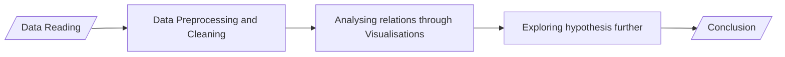

# 📝 Project 09 - EDA on Abalone snail dataset
> **Course**: [Thapar's Machine Learning Summer School, 2025](https://www.thaparsummerschool.com/)
> 
> **Student Name**: Ikansh Mahajan
>
> **Student Roll No.**: 102303754

## 🔎 Problem Statement
Select any dataset from [UCI Dataset Repository](https://archive.ics.uci.edu/datasets) and perform Exploratory Data Analysis

## 🔬 Methodology

## 🚀 How to Run Notebook
Click on the    button on top of the notebook to open it in Google Colab and experiment with my solution by copying it to your Drive.

## 🧾 Reflections
This project gave me amazing hands-on exposure to data preprocessing and analysis of real-world datasets.

## ⚠️ Report Issues
Create an issue ticket using the `Issues` section up above.
